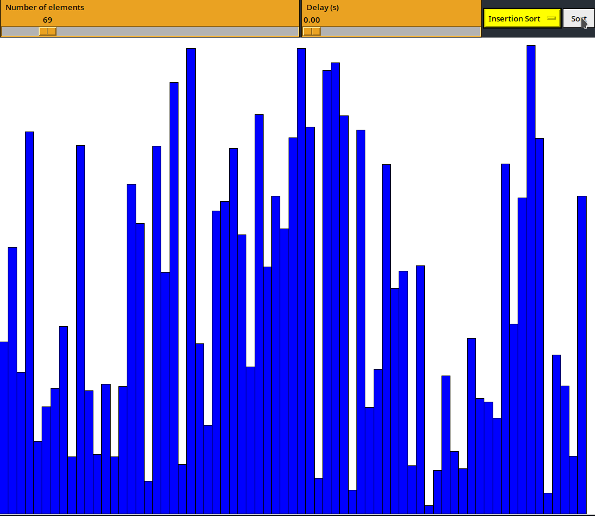

# Sorting Visualizer

This is a Sorting Visualizer program that displays a graphical representation of various sorting algorithms. It was implemented using Python's `tkinter` library for the GUI and allows the user to visualize: 
- Bubble sort
- Selection sort
- Insertion sort



## Getting Started

### Prerequisites
- Python 3.6 or later
- Tkinter library

### Installation

Clone this repository:
``` bash
git clone https://github.com/uppercasee/sorting-visualizer.git
```

### Install Tkinter:

- For Ubuntu:

```csharp

    sudo apt-get install python3-tk
```

- For Windows or Mac:
    - Tkinter should be installed with Python by default.

### Usage

1. Open the terminal and navigate to the directory where the program is saved.
2. Run the program by typing:
`python sorting_visualizer.py`
3. A window will pop up displaying the program's user interface.
4. Use the slider to choose the number of elements you want to sort.
5. Use the delay slider to adjust the delay between each comparison.
6. Select a sorting algorithm from the dropdown menu.
7. Click on the "Sort" button to visualize the sorting algorithm.

# To-Do:
1. Merge Sort
2. Heap Sort
3. Quick Sort
4. and others (maybe)
<!-- 5. Add Error Handling -->
<!-- 6. Implement logging so debugging could be easier. -->

# Acknowledgments
This program was heavily inspired by [15 Sorting Algorithms in 6 Minutes](https://youtu.be/kPRA0W1kECg) - [Timo Bingmann](https://www.youtube.com/@TimoBingmann)
